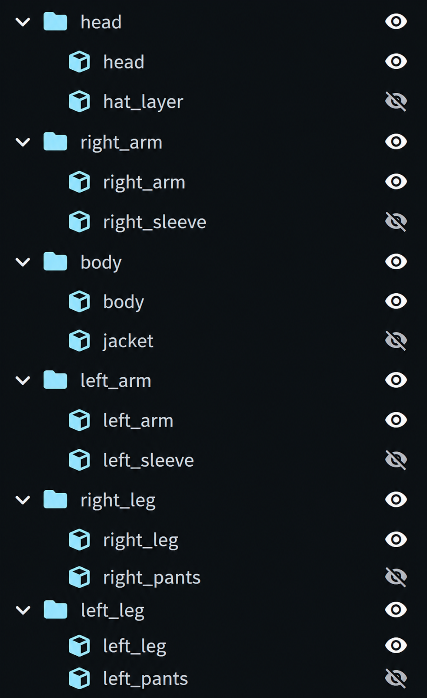

# Required Bone Structure / Estructura Obligatoria
<table>
<tr>

<td>

</td>

<td>
<pre>
head
└── headwear

body
└── jacket

right_arm
└── right_sleeve

left_arm
└── left_sleeve

right_leg
└── right_pants

left_leg
└── left_pants
</pre>
</td>

</tr>
</table>

> The hierarchy shown above is necessary for a correct conversion to EMF, but the order does not matter at all.
> 
> La jerarquía mostrada arriba es necesaria para una conversión correcta a EMF, pero el orden no importa en absoluto.

---

# Possible Issues and limitations:
> Custom animations require a continuously increasing progress variable supplied externally. Boolean variables are not supported.
> 

If you find any more, please provide feedback.
